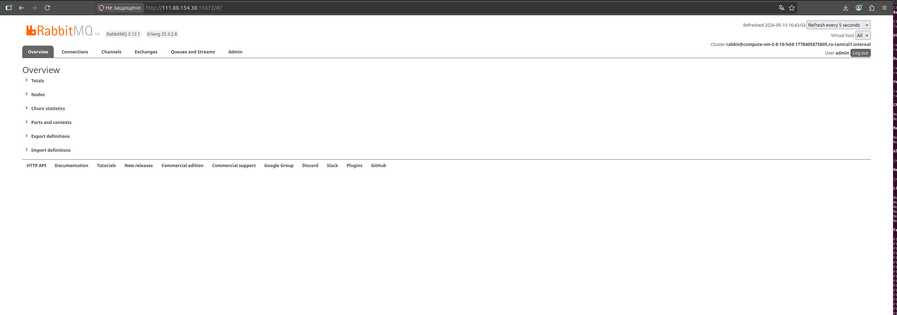
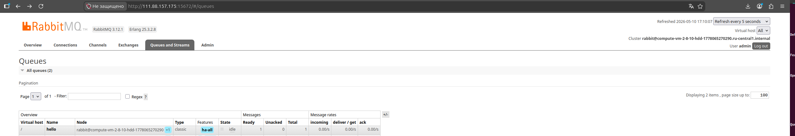
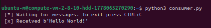

# Домашнее задание к занятию «Очереди RabbitMQ»

**Выполнил:** Чехлов Михаил

## Задание 1. Установка RabbitMQ

## Задание 2. Отправка и получение сообщений

## Задание 3. Подготовка HA кластера

                             

