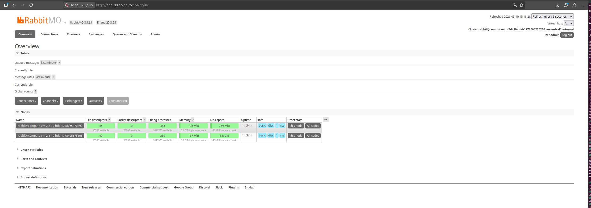
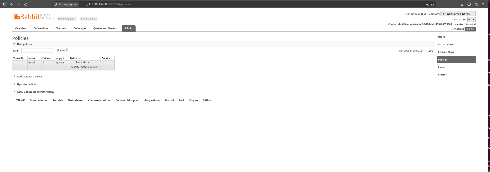
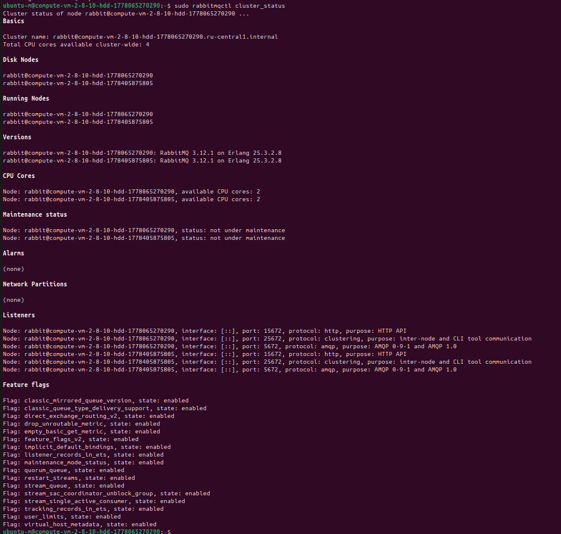
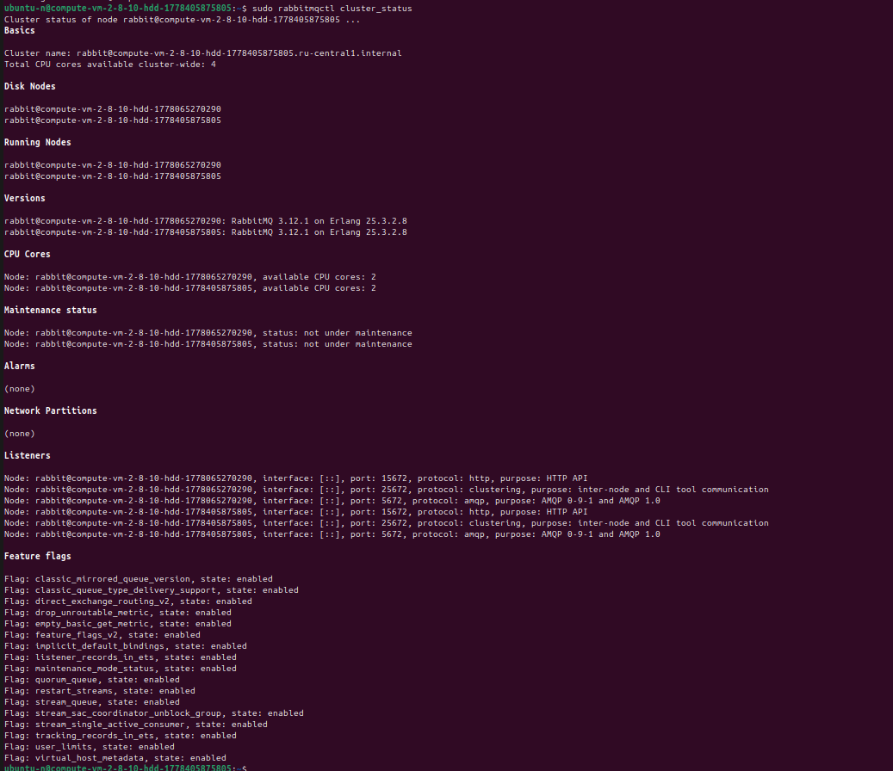
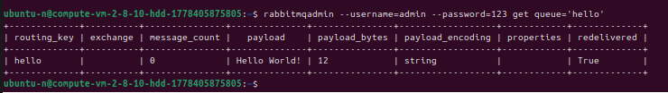
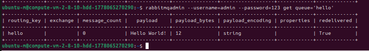
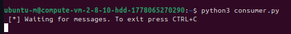
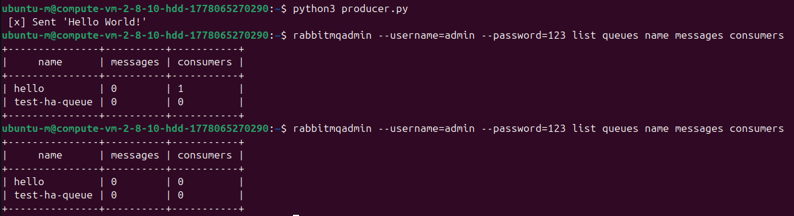

# Домашнее задание к занятию «Очереди RabbitMQ»

**Выполнил:** Чехлов Михаил

## Задание 1. Установка RabbitMQ

Результат успешной установки подтверждён скриншотом веб‑интерфейса RabbitMQ:

## Задание 2. Отправка и получение сообщений

Демонстрация работы с очередями:

1. Скриншот веб‑интерфейса с очередью `hello`:
   

2. Скриншот терминала, показывающий работу потребителя (consumer):
   

## Задание 3. Подготовка HA‑кластера

Результаты настройки высокодоступного кластера RabbitMQ:

1. Состояние нод кластера (скриншот веб‑интерфейса):
   

2. Настроенные политики (policies) кластера:
   

3. Статус кластера через команду `rabbitmqctl cluster_status`:
   * Вариант 1: 
   * Вариант 2: 

4. Информация о очереди `hello` через `rabbitmqadmin`:
   * Скриншот 1: 
   * Скриншот 2: 

5. Работа Python‑потребителя:
   

6. Дополнительные данные:
   * Вывод команды `consumer`: 
   * Общий вывод `rabbitmqadmin`: 
